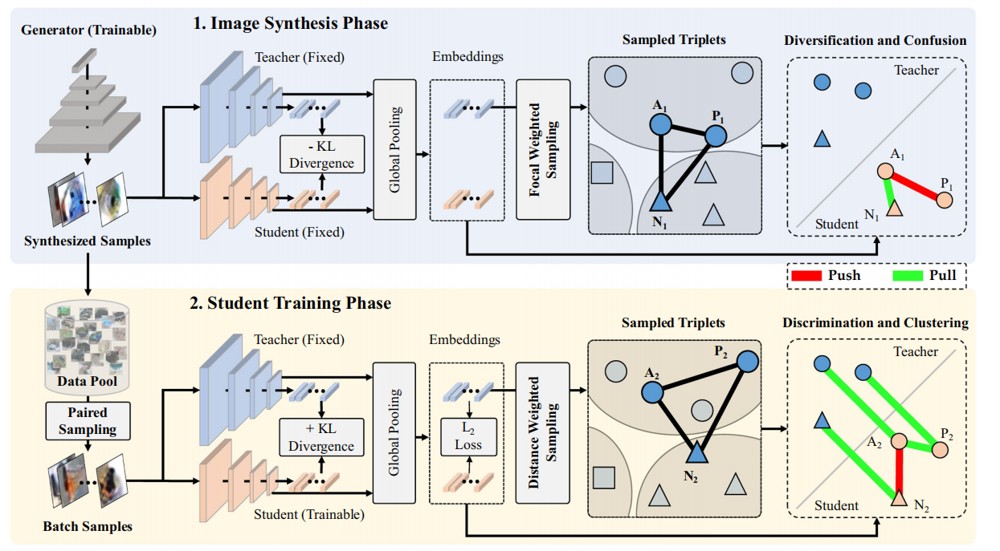

## News
* `2024/12/20` We release the code for the *data-free knowledge distillation* tasks.

# RGAL

This is a PyTorch implementation of the following paper:

**Relation-Guided Adversarial Learning for Data-Free Knowledge Transfer**, IJCV 2024.

Yingping Liang and Ying Fu

[Paper](https://link.springer.com/article/10.1007/s11263-024-02303-4)



**Abstract**: *Data-free knowledge distillation transfers knowledge by recovering training data from a pre-trained model. Despite the recent success of seeking global data diversity, the diversity within each class and the similarity among different classes are largely overlooked, resulting in data homogeneity and limited performance. In this paper, we introduce a novel Relation-Guided Adversarial Learning method with triplet losses, which solves the homogeneity problem from two aspects. To be specific, our method aims to promote both intra-class diversity and inter-class confusion of the generated samples. To this end, we design two phases, an image synthesis phase and a student training phase. In the image synthesis phase, we construct an optimization process to push away samples with the same labels and pull close samples with different labels, leading to intra-class diversity and inter-class confusion, respectively. Then, in the student training phase, we perform an opposite optimization, which adversarially attempts to reduce the distance of samples of the same classes and enlarge the distance of samples of different classes. To mitigate the conflict of seeking high global diversity and keeping inter-class confusing, we propose a focal weighted sampling strategy by selecting the negative in the triplets unevenly within a finite range of distance. RGAL shows significant improvement over previous state-of-the-art methods in accuracy and data efficiency. Besides, RGAL can be inserted into state-of-the-art methods on various data-free knowledge transfer applications. Experiments on various benchmarks demonstrate the effectiveness and generalizability of our proposed method on various tasks, specially data-free knowledge distillation, data-free quantization, and non-exemplar incremental learning.*

## Document

[To Do]

## License and Citation
This repository can only be used for personal/research/non-commercial purposes.
Please cite the following paper if this model helps your research:

```
@article{liang2024relation,
  title={Relation-Guided Adversarial Learning for Data-Free Knowledge Transfer},
  author={Liang, Yingping and Fu, Ying},
  journal={International Journal of Computer Vision},
  pages={1--18},
  year={2024},
  publisher={Springer}
}
```

## Acknowledgments
* The code for inference and training is heavily borrowed from [CMI](https://github.com/zju-vipa/CMI), we thank the author for their great effort.
